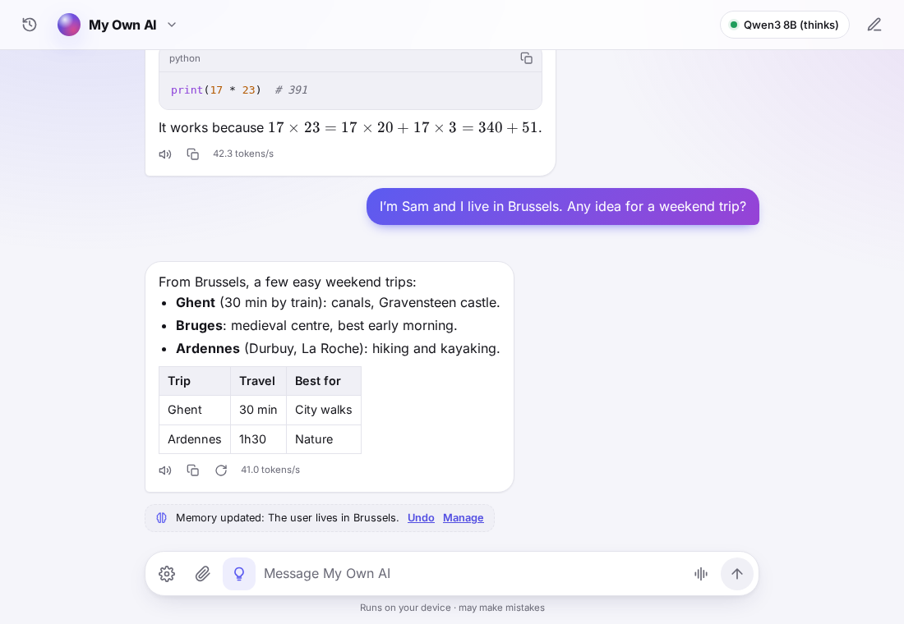
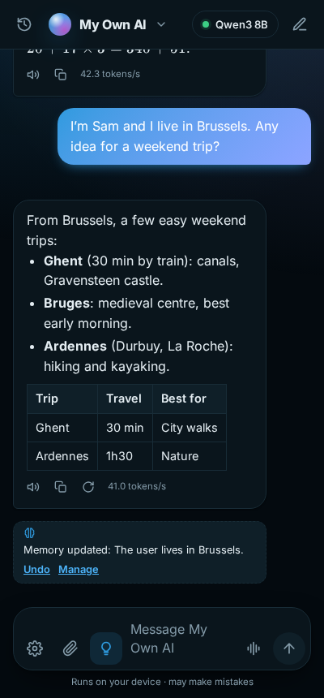
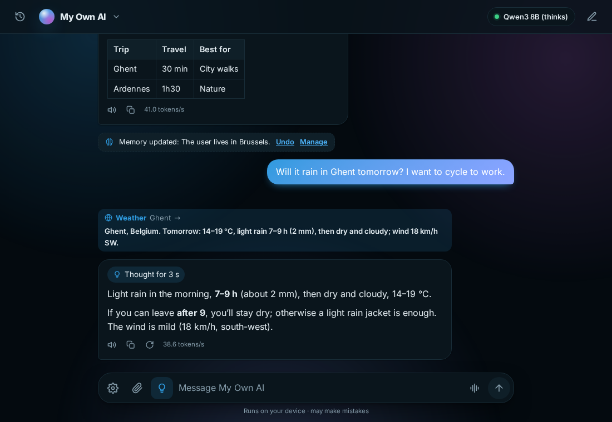
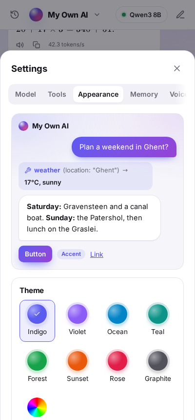

# My Own AI

**A private AI assistant that runs on your own device — in the browser, on Android, and on Windows, Mac and Linux.**
No account, no subscription, no cloud: your conversations, documents, voice and memories stay with you.

**[Try it in your browser at my-own-ai.app](https://my-own-ai.app)**: nothing to install. The model downloads once and then runs on your device.

<p>
  
  
</p>

My Own AI is an assistant, not just a model runner: it searches the web, reads pages and your
documents, runs code, remembers what matters to you and talks with you — and it picks the model
that fits your hardware, from a phone to a gaming PC.

## Ways to use it

| | Runs on | Best for |
|---|---|---|
| **Browser**, at [my-own-ai.app](https://my-own-ai.app) | Any recent Chrome, Edge or Brave with WebGPU (also Safari 26+, Chrome on Android) | Trying it with zero install; works offline once installed as an app |
| **Android app** | Phones with WebGPU (Android 12+, recent Qualcomm or ARM GPUs) | Your assistant in your pocket, with real web search |
| **Desktop app** | Windows, macOS (Apple Silicon) and Linux; with a GPU of 8 GB+ (NVIDIA, AMD Radeon, Intel Arc, Apple M-series) it runs large models natively | The full experience: big models, your folders, connectors (image generation and Whisper: Windows with NVIDIA) |

### Install

Everything is on the [latest release](https://github.com/JulienAerts/my-own-ai/releases/latest) (the website
also offers the right file for your system in Settings → App):

| System | File | First start |
|---|---|---|
| Windows | `My.Own.AI_<version>_x64-setup.exe` | SmartScreen may warn about an unknown app: *More info → Run anyway* |
| macOS (Apple Silicon) | `My.Own.AI_<version>_aarch64.dmg` | Drag the app to Applications, then right-click it → *Open* the first time |
| Linux | `My.Own.AI_<version>_amd64.AppImage` (or the `.deb`) | Make the AppImage executable, then open it |
| Android | `My.Own.AI_<version>_android.apk` | Allow installs from your browser when Android asks (Play Protect may call it an unknown app: *More details → Install anyway*) |

The desktop app updates itself: it checks GitHub for new versions signed with the project's key, and shows what
changed before installing. On Android, install a newer APK over the old one; your conversations stay. What changed in
each version is in the [changelog](CHANGELOG.md). The desktop installers aren't signed with a code-signing
certificate yet, hence the warnings above.

## What it can do

**Chat with models on your device**
- Picks a model for your hardware and context size for your GPU memory; you can choose others, add any model from the
  [WebLLM catalog](https://github.com/mlc-ai/web-llm) or, in the desktop app, any GGUF model from Hugging Face (gated models with your token).
- Reasoning models (Qwen3, Qwen3.5) with a live, foldable "Thought for 12 s" view and a Think switch.
- Images: Phi-3.5 vision in the browser, Qwen3.5 in the desktop app.
- Markdown with highlighted code (copy button), maths (KaTeX) and tables.
- Edit and resend, regenerate (earlier answers kept: ‹ 1/2 ›), read aloud, copy.
- Long conversations: a rolling summary keeps the thread, and the exact details from early on (a code, a
  name, a number) come back when you ask about them.
- Conversations: search inside every message, rename, pin to the top, save one as Markdown.

**Tools**
- Web search and news, reading web pages (full search and page reading in the apps), weather, currency, units, dictionary, calculator, date.
- A code sandbox (Python with numpy, pandas, matplotlib — or JavaScript), isolated from your data and the network, with charts in the chat.
- Chat with your documents (PDF, text, Markdown, CSV…), searched by meaning on your device.

**Memory, assistants and skills**
- Memory: it notes facts you share, in any language (with an *Undo*), and keeps them up to date: "we moved to Paris"
  replaces where you lived before, and temporary things (a trip next week) are forgotten after two weeks. It uses the
  memories relevant to each question; you see and edit them all in Settings → Memory.
- Assistants: named setups (*Code helper*, *Tutor*…) with their own instructions, tools, documents, memory and preferred model.
- Skills: packaged instructions and scripts (the `SKILL.md` format) the model opens when a task needs them.

**Voice**
- Dictation and hands-free voice mode, in English, French and 23 other languages; answers read aloud with on-device voices (English and French).
- Windows with an NVIDIA GPU: Whisper large-v3-turbo, in about 100 languages.

**Desktop app extras**
- llama.cpp on your GPU (CUDA or Vulkan on Windows, Vulkan on Linux, Metal on Apple Silicon): Qwen3 up to 32B, Qwen3.5 with images, or your own GGUF models; contexts up to 128k (Qwen3) and 256k (Qwen3.5) tokens.
- **Connectors (MCP)**: plug in any Model Context Protocol server (files, GitHub, databases, Home Assistant…) with Claude Desktop's config format; actions that change something ask you first.
- **Your folders**: the assistant can list, read and search folders you choose, and save files there after asking.
- **Image generation** with Z-Image-Turbo, a few seconds per image (Windows with an NVIDIA GPU).
- Ctrl+Alt+Space from any app, a tray icon, start with Windows; optional local OpenAI-compatible API for your other apps; optional access to your own Python (asks before every run).

**Make it yours**: eight themes or any colour, light/dark/pure black; your own logo (orb, aurora, halo, an emoji or your picture) and background (glow, a slowly moving aurora, mesh, dots or your photo); bubble style, corners, text size and font.
In English or French (it follows your device, or choose in Settings → App).

<p>
  
  
</p>

## Privacy

Everything runs on your device: the models, speech recognition, voices, document search, memory and the code sandbox.
There is no account, no analytics and no server of ours. What does go out, and only when used:

- **Model and voice downloads**, once, from Hugging Face (and the runtimes from jsDelivr and GitHub releases).
- **Web tools** send only their query (a search, a city name, a page address) to the service named in Settings → Tools — never your conversation. Each call shows in the chat, and each tool can be turned off.
- **Connectors** you add yourself talk to whatever server you configured.

**Settings → Network** lists every request the app made since it opened (what, where, why and how big), so you can check this yourself.

Pages, files and tool results can contain instructions aimed at the model ("prompt injection"). The app doesn't
rely on the model ignoring them: a web address the model makes up opens only after you agree, a memory saved right
after reading outside content asks first, and actions that change something always show what will happen. Details
and limits are in [SECURITY.md](SECURITY.md).

Your data lives in your browser's or the app's storage. Settings → App saves a backup of conversations, memories,
assistants and skills, and *Report a problem* prepares a bug report with diagnostics but none of your conversations.

## Models

The app recommends models for your device; all are downloaded on demand from their publishers' Hugging Face pages.

| Where | Models |
|---|---|
| Browser and Android (WebLLM) | Qwen2.5 0.5B / 1.5B, Llama 3.2 1B, Hermes 3 (Llama 3.2 3B and 3.1 8B), Phi-3.5 mini, Phi-3.5 vision, Qwen3 0.6B–8B, + the WebLLM catalog |
| Desktop app with a GPU of 8 GB+ (llama.cpp) | Qwen3 8B, 14B, 30B-A3B, 32B, Qwen3.5 9B and 27B (images), + any GGUF from Hugging Face |
| Speech | Phonon-2 (English) or Parakeet v3 (French and 24 other languages) on-device, Whisper large-v3-turbo (Windows with NVIDIA) |
| Voices | Piper in English (Lessac, Ryan, Alba, Alan) and French (Siwis, Tom), or your device's own voices |

Each model keeps its own license; see [THIRD_PARTY.md](THIRD_PARTY.md).

## Build from source

You need [Node.js](https://nodejs.org) 22.

```sh
npm install
npm run dev               # http://localhost:5173 — the browser version
npm run build             # production build in dist/
npm test                  # unit tests (Vitest)
npx playwright test       # end-to-end tests in a real browser, with a stand-in model
```

- **Android**: JDK 21 and the Android SDK (platform 36), then `npm run android` builds a debug APK
  (`android/app/build/outputs/apk/debug/`).
- **Desktop**: install Rust and the [Tauri prerequisites](https://v2.tauri.app/start/prerequisites/), then `npm run tauri build`.
- **Releases**: a `desktop-v*` tag builds Windows, macOS, Linux and the signed Android app on GitHub Actions and
  publishes them together; see [docs/RELEASING.md](docs/RELEASING.md).

The README's screenshots come from `SCREENSHOTS=1 npx playwright test screenshots` (a sample conversation, no real data).

How it works inside — WebGPU limits on phones, the tool-calling grammars, the sandbox, the native engines — is written up in
[docs/ENGINEERING.md](docs/ENGINEERING.md).

## Contributing

Bug reports, ideas and pull requests are welcome: see [CONTRIBUTING.md](CONTRIBUTING.md).
Security issues: please report them privately, as described in [SECURITY.md](SECURITY.md).

## License

My Own AI is free software under the [GNU General Public License v3.0 or later](LICENSE).
It builds on many open-source projects and openly licensed models, listed with their licenses in [THIRD_PARTY.md](THIRD_PARTY.md).
